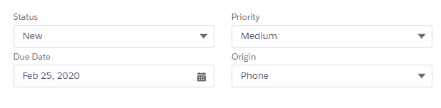

# lwc-picklist

Field level LWC to wrap both `getPicklistValues` from `lightning/uiObjectInfoApi` and display in a `lightning-combobox`

## Public Members

| Name | Type | Description |
|---|---|---|
| fieldDescribe | prop | Required, The Schema Field Description |
| recordTypeId | prop | Required, The Record Type Id for the SObject Field |
| default | prop | Override the field's default value with your own |
| label | prop | Required, the text label for the combobox |
| fieldLevelHelp | prop | The help text for the combobox |
| disabled | prop | The disabled state of the combobox, default false |
| required | prop | Mark the combobox required, default false |
| variant | prop | The variant of the `lightning-combobox`. Accepted Values of standard, label-hidden, label-inline, and label-stacked. Defaults to `standard`. |
| onselected | event | Event fired when a the combobox is changed. `event.detail = option.value` |

## Demo



## Usage

Get the RecordTypeId and Schema Field Desription in your component, then pass it to `c-picklist` through a computed property.

MyComponent.html
```html
<template>
  <c-picklist
    label="Status"
    default="In Progress"
    field-describe={statusDescribe}
    record-type-id={recordTypeId}
    onselected={onStatusChange} ></c-picklist>
</template>
```

MyComponent.js
```javascript
import { LightningElement, track } from 'lwc'
import STATUS from '@salesforce/schema/Case.Status'

export default class CecCaseForm extends LightningElement {

  @track status
  @track recordTypeId = '0120b000000VXQwAAO'

  get statusDescribe () { return STATUS }

  onStatusChange (event) {
    this.status = event.target.value
  }
}
```